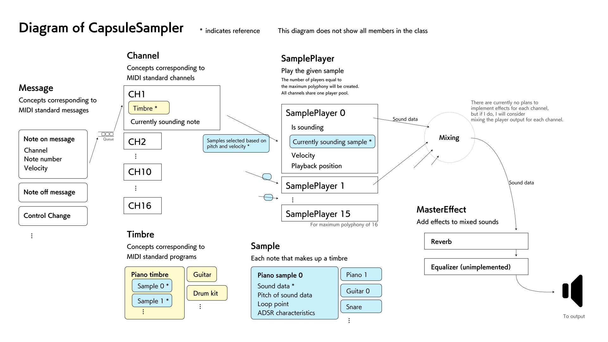

# CapsuleSampler (formerly CoreS3-Sampler-Playground)

[日本語](README.md)

A sampler library for ESP32

You can use it as a MIDI sound source by providing your own sound data.

## Configuration diagram



## Getting started

### PlatformIO

Append the following in platformio.ini

```ini
lib_deps = 
  https://github.com/wararyo/CapsuleSampler.git
```

## Creating tones

In order to run CapsuleSampler, you must create your own tones.

### Creating sound data

Sound data is an array of int16_t and must satisfy the following conditions.

* Sample rate 48000Hz
* For one-shot, about 1024 samples of silence should be reserved after the sound data
* For looping sound, place the same waveform as the loop section repeatedly after the loop point to reserve a margin of about 1024 samples

### Creating samples

Sample is a structure with the following members.

* Sound data
* Length of sound data (number of samples)
* Pitch when the sound data is played back at constant speed
* Start sample of the loop section (only when ADSR is enabled)
* End sample of loop section (only when ADSR is enabled)
* Whether ADSR is enabled or not (if false, it is considered as one-shot)
* Attack (0.0, 1.0]
* Decay (0.0, 1.0]
* Sustain [0.0, 1.0]
* Release [0.0, 1.0]

#### ADSR characteristics

For faster processing, the ADSR characteristic is specified as follows instead of specifying milliseconds.

##### Attack

This value is added to the volume every 64 samples.

Example:.

* 0.01 - equivalent to 6400 samples (133 ms) of attack time
* 1.0 - equivalent to 0 samples (0ms) attack time

##### Decay

Every 64 samples the volume approaches sustain at this rate.

Example:

* 0.999 - sound decays slowly
* 0.980 - sound decays a little faster
* 0.900 - sound decays fairly quickly

##### Sustain

If the note is kept on long enough, the volume will eventually reach this value.

Example:

* 1.0 - the sound does not decay
* 0.1 - the amplitude of the sound will eventually be 10% (-20dB) of the value immediately after the attack
* 0.0 - sound will eventually be silent

##### Release

After note off, the volume is multiplied by this value every 64 samples.

### Creating timbres

Create a timbre containing one or more samples.
The sampler can be sounded by setting it to each channel.

A timber is an array of structures consisting of the following members.

* Sample
* Lower limit of note number (including this number itself)
* Upper limit of note number (including this number itself)
* Lower limit of velocity (including this velocity itself)
* Upper limit of velocity (including this velocity itself)

Imagine plotting rectangles on a plane with note number on the horizontal axis and velocity on the vertical axis.

The array must satisfy the following constraints.

* When any two are taken out, their note number ranges must either match exactly or not overlap at all.
* When any two with the same lowerNoteNo are taken out, their velocity ranges do not overlap.
* Items are listed in ascending order of lowerNoteNo.
    * Items with the same lowerNoteNo are listed in ascending order of lowerVelocity.
